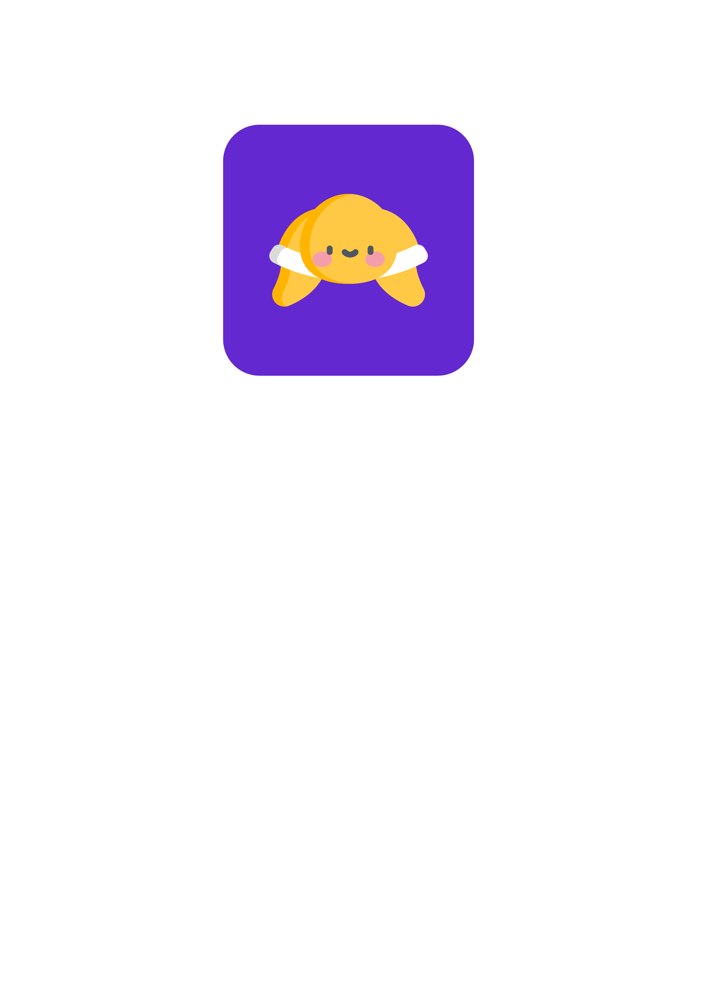

<!-- PROJECT LOGO -->
<br />
<h6 align="center">Carmen Seesink IDV 301</h6>
<p align="center">
</br>
   
  <a href="https://github.com/CarmenSeesink/seeturtle ">
    
  </a>
  
  <h3 align="center">seetrutle</h3>

  <p align="center">
    Enjoy, play, learn
  </p>


<!-- TABLE OF CONTENTS -->
## Table of Contents

* [Project Description](#project-description)
  * [Built with](#built-with)
* [Getting Started](#getting-started)
  * [Prerequisites](#prerequisites)
  * [How to install](#how-to-install)
*[Unit Testing](#unit-testing)
* [Features and Functionality](#features-and-functionality)
   * [Plant Coral](#plant-coral)
   * [Feed](#multiplayer)
   * [Remove Plastic Waste](#sentences-and-score)
   * [Name your Turtle](#name-your-turtle)
   * [Manual](#manual)
   * [Games](#games)
* [Contributing](#contributing)
* [License](#license)
* [Acknowledgements](#acknowledgements)


<!--PROJECT DESCRIPTION-->
## Project Description

![image1][image1]

According to an article published in the Scientific American by Jones and Watson (2018), 13% of our oceans remain unaffected by human activity. Humans have destroyed marine ecosystems and driven species into the brink of extinction.

The Pacific leatherback sea turtle is an explicit example of a population that has suffered significant declines, driven by a number of factors including plastic pollution, bycatch fishing and the loss of nesting habitats. 

Seeturtle, is a virtual pet application which aims to educate users on the detrimental effects of plastic pollution, in an attempt to motivate users to actively participate in defending our oceans.

### Built With

* [Xamarin Forms]( https://docs.microsoft.com/en-us/xamarin/xamarin-forms/)

<!-- GETTING STARTED -->
## Getting Started

These instructions will get you a copy of the project up and running on your local machine for development and testing purposes.

### Prerequisites

For development, the latest version of Visual Studio is required. The latest version can be downloaded from 

### How to install
 
1. Clone the repo
```sh
git clone https:://github.com/CarmenSeesink/seeturtle.git
```
2. Open the project

Use `Open Workspace` in Visual Studio.


## Unit Testing

These are two examples of unit tests that can be run on this system:

### GetLevelFromXpTest

The following test checks if the correct level is selected based on the Xp level. Navigate to Test Explorer and run unit tests.

```
//ARRANGE
int xp = 1500;
int expectedLevel = 1;

//ACT
var result = Level.GetLevelFromXp(xp);


//ASSERT
Assert.AreEqual(expectedLevel, result);
```

### GetTurtleStateTest

The following test checks if the correct state is selected based on the turtle string. Navigate to Test Explorer and run unit tests.

```
//ARRANGE
string turtleString = "good";
var expectedState = TurtleState.good;

//ACT
var result = TurtleStates.GetTurtleState(turtleString);

//ASSERT
Assert.AreEqual(expectedState, result);
```


<!-- FEATURES AND FUNCTIONALITY-->
## Features and Functionality

![image2][image2]

### Plant Coral

Plant coral colonies and see how your turtle’s happiness level increases and the sea life multiples.

### Feed your Turtle

Feed your turtle by tapping on the jellyfish.

### Remove Plastic Waste

Remove plastic pollution by tapping on the plastic bags before they make your turtle sick.

![image3][image3] 

### Name your Turtle

Choose a name for your turtle.

### Games

Play games and earn points that increase your turtle’s happiness.

### Manual

Discover what it means to be part of a marine conservation team.

<!-- CONTRIBUTING -->
## Contributing

Contributions are what make the open source community such an amazing place to be learn, inspire, and create. Any contributions you make are **greatly appreciated**.

1. Fork the Project
2. Create your Feature Branch (`git checkout -b feature/AmazingFeature`)
3. Commit your Changes (`git commit -m 'Add some AmazingFeature'`)
4. Push to the Branch (`git push origin feature/AmazingFeature`)
5. Open a Pull Request

<!-- AUTHORS -->
## Authors

* **Carmen Seesink** - [CarmenSeesink](https://github.com/CarmenSeesink)

<!-- LICENSE -->
## License

Distributed under the MIT License. See `LICENSE` for more information.

<!-- ACKNOWLEDGEMENTS -->
## Acknowledgements

* [Showing tooltips in Xamarin Forms](https://www.xamboy.com/2019/03/01/showing-tooltips-in-xamarin-forms/)
* [Custom renderers for Xamarin Forms](https://www.youtube.com/watch?v=ux09gAB13kQ)
* [The Last of the Ocean Wilderness]( https://blogs.scientificamerican.com/observations/the-last-of-the-ocean-wilderness/)
* [Lottie Animations for Xamarin Apps]( https://www.youtube.com/watch?v=vo0_pVMXRAo)
* [Xamarin Forms Animations]( https://www.youtube.com/watch?v=ypKnAKJL9CA)

<!-- MARKDOWN LINKS & IMAGES -->
[image1]: Images/1.png
[image2]: Images/2.png
[image3]: Images/3.png


